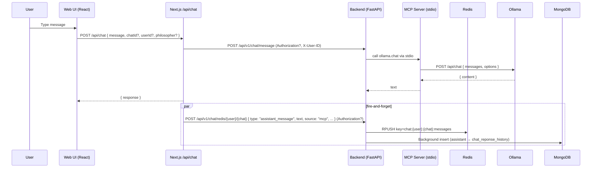
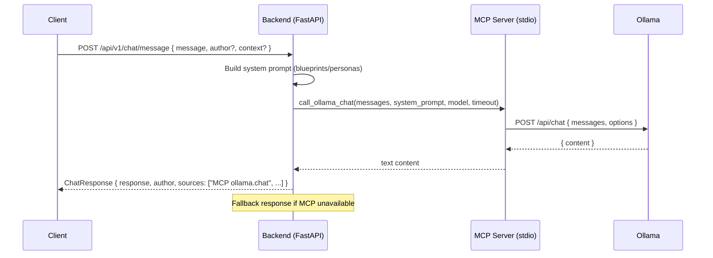

# Daemonium Chat Messaging Flow and Architecture

This document explains how a user’s chat message flows through the Daemonium system and how each component processes and persists it. It covers both the MCP-backed web UI path (default) and the backend MCP path, with an Ollama proxy fallback.

## Components

- **web-ui**: Next.js 15 app with React 18 UI.
  - Entry chat page: `web-ui/src/app/chat/page.tsx`
  - Chat container: `web-ui/src/components/chat/chat-page-container.tsx`
  - API route (default): `web-ui/src/app/api/chat/route.ts`
  - API proxy fallback: `web-ui/src/app/api/ollama/route.ts`
- **backend**: FastAPI service.
  - App: `backend/main.py`
  - Chat router: `backend/routers/chat.py`
  - MCP client helper: `backend/mcp_client.py`
- **mcp-service**: Stdio MCP server bridging to Ollama.
  - Server: `mcp-service/mcp_server.py`
- **Ollama**: Local LLM server (HTTP API).
- **Redis**: Chat timeline storage (per user_id + chat_id).
- **MongoDB**: Long-term persistence of chat history and assistant responses.
- **Firebase**: Token-based auth for Redis endpoints (optional for local tests).

Docker Compose wires services, networks, volumes, and environment variables.

---

## End-to-end flows

### Flow A: MCP-backed path via Next.js `/api/chat` (default in the web UI)
1. **UI sends message**
   - The chat UI posts to `POST /api/chat` (Next.js API route).
   - Body fields: `message` (required), `chatId`, `userId`, `philosopher` (optional; mapped to backend `author`).

2. **Forward to backend MCP endpoint**
   - `web-ui/src/app/api/chat/route.ts` forwards the request to `POST {BACKEND_API_URL}/api/v1/chat/message`.
   - Forwards headers: `Authorization` (Firebase ID token when present) and `X-User-ID`.

3. **Personality enrichment (optional)**
   - Backend looks up blueprints/personas to build a system prompt matching the philosopher voice (`author`).

4. **Centralized model + timeout selection**
   - Backend uses `config/ollama_config.py` for task type `general_kg` model and timeouts.

5. **Invoke MCP Ollama chat**
   - Backend calls the MCP stdio server tool `ollama.chat`, which hits Ollama’s `/api/chat`.

6. **Return assistant response to UI**
   - Backend returns `ChatResponse { response, author, sources }`.
   - Next.js route relays this JSON to the UI.

7. **Fire-and-forget assistant persistence**
   - The Next.js `/api/chat` route asynchronously posts the assistant reply to the backend:
     - `POST {BACKEND_API_URL}/api/v1/chat/redis/{user_id}/{chat_id}` with body like:
       ```json
       { "type": "assistant_message", "text": "...", "model": "...", "source": "mcp", "original": { ... }, "context": { "philosopher": "..." } }
       ```
   - Includes `Authorization` when available. UI rendering is not blocked on this call.

8. **Background MongoDB persistence**
   - The backend’s Redis push endpoint schedules background writes into MongoDB:
     - User messages → collection: `chat_history`
     - Assistant messages → collection: `chat_reponse_history`

### Flow B: Backend MCP path (FastAPI mediates via MCP)
1. **Client sends message to backend**
   - `POST /api/v1/chat/message` with Pydantic `ChatMessage`:
     - Required: `message`
     - Optional: `author`, `context`

2. **Personality enrichment (optional)**
   - Backend looks up chat blueprints/personas in MongoDB to build a system prompt matching the philosopher voice (`author`).

3. **Centralized model + timeout selection**
   - Uses `config/ollama_config.py` (`get_ollama_config()`) to select model/timeout for task type `general_kg`.

4. **Invoke MCP Ollama chat**
   - `backend/mcp_client.py` spawns the stdio MCP server (`mcp-service/mcp_server.py`).
   - Calls MCP tool `ollama.chat` which hits Ollama’s `/api/chat` endpoint.
   - On success, FastAPI returns a `ChatResponse` including `sources=["MCP ollama.chat", "model=..."]`.
   - On failure, graceful fallback produces a simple philosopher-style response.

5. **Persistence**
   - This endpoint focuses on inference; it does not push messages to Redis by default. Persistence to Redis is handled by the web-ui route in Flow A.

---

## Key backend endpoints (`backend/routers/chat.py`)

- `POST /api/v1/chat/message`
  - Accepts `ChatMessage` and returns `ChatResponse`.
  - MCP stdio call via `call_ollama_chat()` → `mcp-service/mcp_server.py` → Ollama `/api/chat`.
  - Fallback logic if MCP fails.

- `POST /api/v1/chat/redis/{user_id}/{chat_id}` (Firebase auth required)
  - Stores messages in Redis list key `chat:{user_id}:{chat_id}:messages` via `RPUSH`.
  - Accepts body as string or structured JSON. Pulls common fields to top-level:
    - `type` (e.g., `user_message`, `assistant_message`)
    - `text`
    - `state` (session metadata)
    - Always adds `user_id`, `chat_id`, `timestamp`, `date`, and keeps `original`.
  - Optional TTL via `ttl_seconds`.
  - Background task persists to MongoDB:
    - `user_message` → `chat_history`
    - `assistant_message` → `chat_reponse_history`

- `GET /api/v1/chat/redis/{user_id}/{chat_id}` (Firebase auth required)
  - Returns stored messages from Redis as JSON array.

- `GET /api/v1/chat/redis/{user_id}/summaries` (Firebase auth required)
  - Scans Redis keys `chat:{user_id}:*:messages` and builds chat summaries.

---

## Next.js chat route (`web-ui/src/app/api/chat/route.ts`)

- Inputs: `{ message, chatId?, userId?, philosopher? }`.
- Forwards to backend: `POST {BACKEND_API_URL}/api/v1/chat/message` with `Authorization?` and `X-User-ID`.
- Returns: backend `ChatResponse` JSON to the UI.
- Asynchronous assistant persistence: `POST` to backend Redis endpoint with `type: 'assistant_message'`, `source: 'mcp'`.

---

## Next.js proxy route (`web-ui/src/app/api/ollama/route.ts`)

- Inputs: `{ message, chatId?, userId?, philosopher? }`.
- History retrieval: optional `GET` to backend Redis messages when `chatId` and `userId` present.
- Model and base URL resolution:
  - Model: `process.env.OLLAMA_MODEL || 'llama3.1:latest'`
  - Base: `process.env.OLLAMA_BASE_URL || 'http://localhost:11434'` with IPv4 loopback preference and fallback to `host.docker.internal`.
- Returns: `{ response }` to the UI.
- Asynchronous assistant persistence: `POST` to backend Redis endpoint; logs warnings on failure without blocking the UI.

---

## Authentication model

- **Required**: Firebase token for Redis endpoints:
  - `POST/GET /api/v1/chat/redis/...`
  - `GET /api/v1/chat/redis/{user_id}/summaries`
- **Not required** for basic inference tests:
  - `POST /api/chat` (web-ui Next.js route)
  - `POST /api/ollama` (web-ui Next.js route, fallback)
  - `POST /api/v1/chat/message` (backend MCP)
- The Next.js route forwards `Authorization` to the backend when present, enabling authenticated history and persistence in Flow A.

---

## Configuration and environment

- Centralized model/timeouts: `config/ollama_models.yaml` and `config/ollama_config.py` (task type `general_kg`).
- Environment variables (examples):
  - `OLLAMA_BASE_URL=http://ollama:11434` (backend, in Docker)
  - `OLLAMA_MODEL=llama3.1:latest`
  - `BACKEND_API_URL=http://backend:8000` (web-ui, in Docker)
  - `NEXT_PUBLIC_BACKEND_API_URL` for browser-side fetches (if applicable)
  - Legacy: `OLLAMA_API_URL`, `OLLAMA_API_PORT` supported by the Next.js route
- Fallbacks:
  - Next.js route: tries `host.docker.internal:11434` if loopback fails.
  - MCP server: probes `/api/tags` and selects a healthy Ollama URL.

---

## Data model and persistence

- **Redis key**: `chat:{user_id}:{chat_id}:messages`
  - Value: List of JSON objects (insertion-ordered), e.g.:
    ```json
    {
      "user_id": "u123",
      "chat_id": "ollama-local",
      "timestamp": "2025-08-23T07:18:52.798Z",
      "date": "2025-08-23",
      "type": "user_message",
      "text": "Hello",
      "original": { "text": "Hello" }
    }
    ```
- **MongoDB collections** (background writes from backend):
  - `chat_history` (user messages)
  - `chat_reponse_history` (assistant messages)

---

## Sequence diagrams (Mermaid)

### A. MCP-backed default (/api/chat)


### B. Backend MCP path


---

## Health checks and debugging tips

- Backend: `GET http://localhost:8000/health`
- Web-UI: `GET http://localhost:3000/api/health`
- Ollama tags: `GET http://localhost:11434/api/tags` (or `http://host.docker.internal:11434/api/tags`)
- Logs:
  - `docker compose logs backend --tail=200`
  - `docker compose logs web-ui --tail=200`
  - `docker compose logs mcp --tail=200`
  - `docker compose logs ollama --tail=200`

---

## Notes

- Flow A (`/api/chat`) is the default path for the web UI and handles Redis/Mongo persistence.
- Flow B (backend MCP) is ideal for server-side integrations and testing MCP/Ollama health and configuration.
- Redis endpoints require Firebase tokens; unauthenticated local testing is still possible via Flow A or the backend MCP endpoint.
